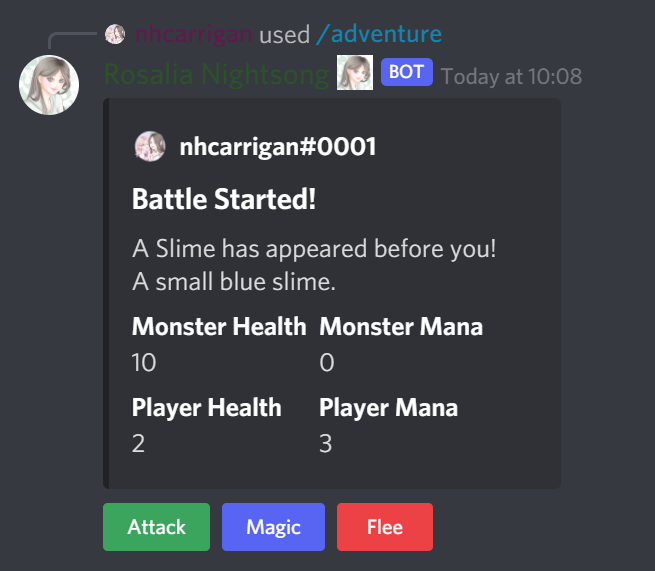

# Time to Battle

Monsters and malicious folk are everywhere in our realm. While our city is safe, the areas outside our walls are not.

It is very likely during your adventures that you will encounter someone or something that wishes to fight.

## Battle System

When you encounter a monster, the battle system will begin. You will see the monster's health and mana, your own health and mana, and buttons for the actions you can take.

Battle is done in a turn based system. For your turn, you may choose one of three actions:

- `Attack` will deal damage to the monster based on your attack minus the monster's defence. If their defence is higher than your attack, you will fail to harm them.
- `Magic` will cast a spell on the monster, dealing damage equal to your attack minus 1/2 of their defence. If their defence is too high, your spell will not harm them. Casting a spell consumes mana equal to your magic, and if you do not have enough mana your spell will fizzle out.
- `Flee` will attempt to escape from the monster. If you succeed, you will return to town, but if you fail the monster will get to act.

If the monster survives your action, it will respond with an action of its own. In addition to the three actions you have, monsters have a chance to get distracted and do nothing for their turn.

## Defeat

If your health falls to 0, you'll be defeated. Thankfully, the guild will be able to detect this and get you back to town safely (this happens to all of us), but you'll find your health and mana significantly depleted.

## Victory

If the monster's health falls to 0, you'll defeat it! The monster will drop some gold, and you'll gain experience. There's a chance the monster will drop some treasure too.
