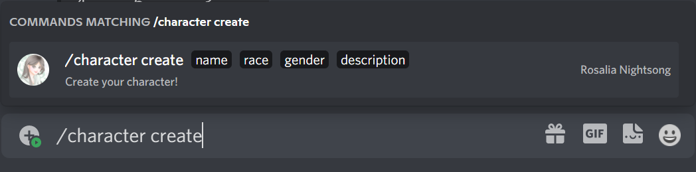
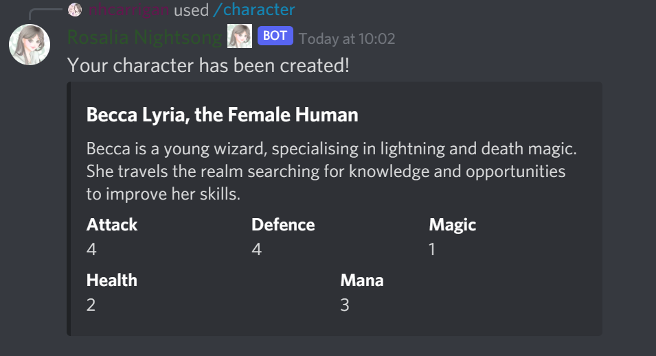

# Create Your Character

Before you can start going on adventures, you need to register with our Guild of Adventurers.

To register your data with us, use the `/character create` command:

With this command, you'll be able to tell us about yourself (don't worry, you can always update this later!), and our guild fairies will rank your skills.

Once you have done this, you are free to begin exploring our realm!

## Stat Information

Our magical fairies will rank your abilities when you register. There are five important stat values you will need to know about.

- `Attack` determines how powerful your physical strikes are.
- `Defence` determines your general ability to resist damage.
- `Magic` determines your proficiency with spellcraft.
- `Health` determines how much pain you can tolerate.
- `Mana` determines how many spells you can sling.
