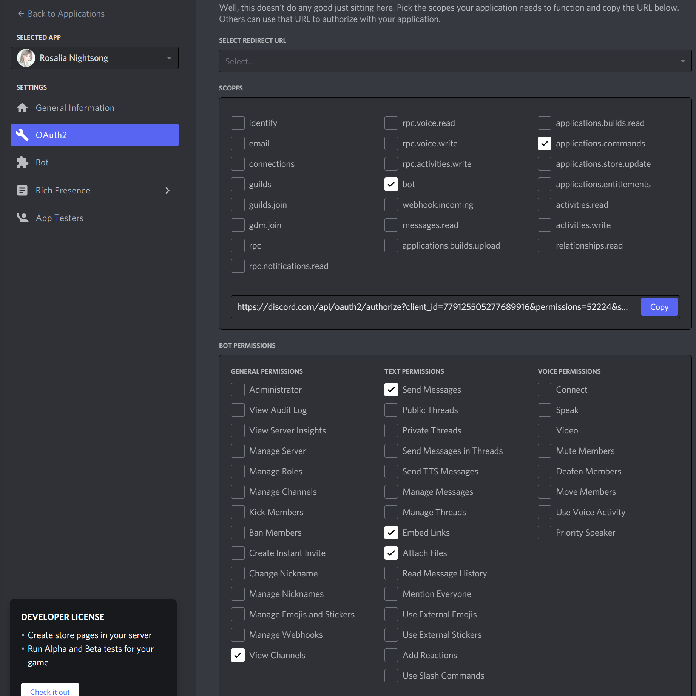
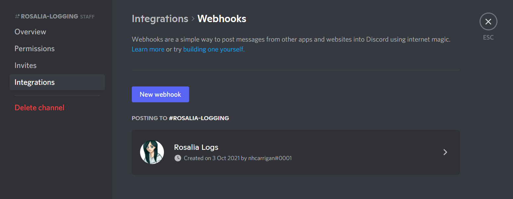

# Discord Setup

Because this is a Discord bot, you'll need to configure some things on Discord before you can run the code.

## Create a Bot

Head to the [Discord Developer Site](https://discord.dev). Click the "New Application" button to create a new Discord app, then select "Bot" from the left and create a new bot for your app.

This bot will be used for testing your changes to Rosalia's code.

Pay attention to the "Token" section under your bot's name - you will need this token later.

### Invite the bot to your server

Under the "OAuth" section you can generate an invite link to add your test bot to your server. Using the generator options, ensure the bot has the `bot` and `application.commands` scopes, and the `View Channels`, `Send Messages`, `Embed Links`, and `Attach Files` permissions.

## Create a Webhook

Rosalia relies on a webhook for debugging messages and error logs. Select a channel in your server, edit that channel, and create a new webhook under the "Interactions" tab.

You will need to copy the URL of the webhook for the next step.
