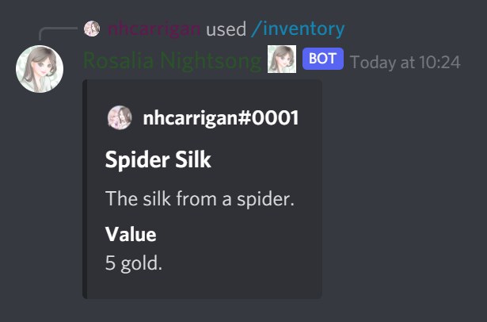
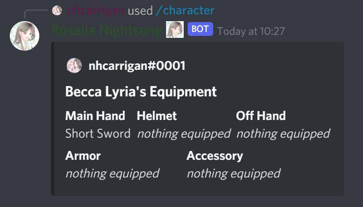

# Manage Your Items

As you continue to explore, you'll find all sorts of items! Items come in three different forms:

- `Equippable` items can be equipped, and provide a bonus to your stats until you remove them.
- `Consumable` items are single use, but provide a permanent bonus.
- `Sellable` items are useless, but can be sold in our market for gold!

## Viewing Items

Are you unsure of what that shiny thing you just picked up does? Use the `/inventory details` command and provide the name of the item you want to examime.

If you've forgotten the name of the item you just grabbed, use `/inventory view` to see the contents of your backpack!

## Using Items

Items can be used with the `/inventory use` command (remember that sellable items cannot be used!).

### Equipment

If you use an equippable item, one of three things will happen:

- If the equipment slot is empty, the item will be equipped in that slot.
- If the item is already in the equipment slot, it will be removed from that slot.
- If the slot has a different item, that item will be removed and your new item will be equipped.

You can check your current equipment with the `/character equipment` command.

Equipment items remain in your inventory while equipped, and still take a backpack slot.

### Consumables

If you use a consumable item, it is automatically removed from your inventory and the bonus is immediately applied.

## Market

Our town has a large marketplace, with multiple shoppes you can visit. To visit a shoppe and see what they have to sell, use the `/market visit` command and select your destination.

### Magic Shoppe

The Magic Shoppe sells various tomes and scrolls, which you can use to increase your stats and become stronger.

### Blacksmith

The blacksmith sells various weapons.

### Armorer

The armorer sells protective gear.

### Alchemist

The alchemist sells potions and healing items.
